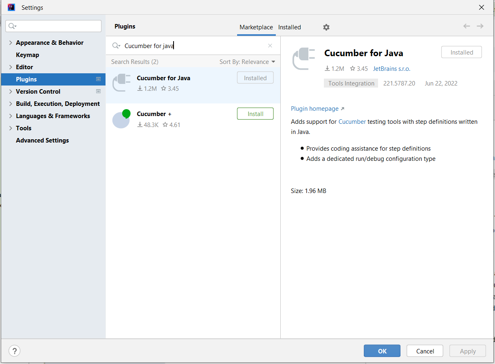
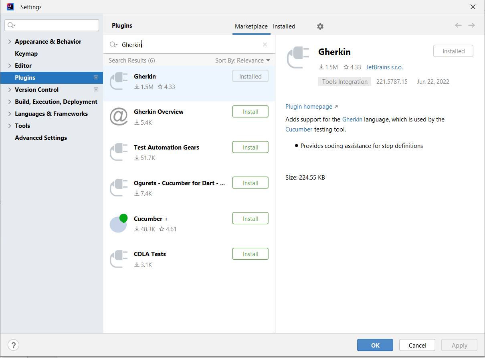
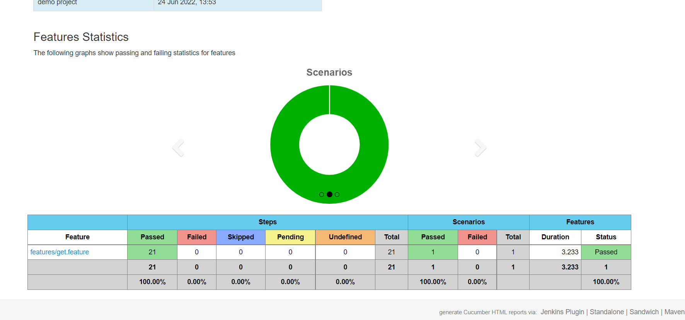

**KARATE AUTOMATED TESTS:**

This is a maven based framework used for Pet Swagger for Api Testing via Karate

The framework aims to run the test using the tags through terminal

**TABLES OF CONTENTS:**
    
    Prerequisites | Installation | Dependencies | Usage | Reports

**Getting Started:**

**Pre-requisites:**
    
   Make sure you have installed all the pre-requisites
    
    Jdk 8 
    Maven 3.8.6
    Karate 0.9.5
    Intellij Ide 22.1.2

**Installations:**
 
   Make sure you install the plugins required for karate
    
    .Cucumber for java : Click on File -> Settings -> Plugins -> MarketPlace -> Search Cucumber for Java

    .Gerkin plugin : Click on File -> Settings -> Plugins -> MarketPlace -> Search Gherkin Plugin

**Dependencies**

   Dependencies required to add in pom.xml    

    .karate-junit5
    .karate-apache
    .cucumber-reporting
    	
**Usage:**
To start the test execution 

   Open command prompt or terminal

   Navigate to project folder and execute,

    -> mvn clean test "-DconfigPath= <path of the environment config. file>" "-tags=@<tag1,tag2>"

   For Example:

    -> mvn clean test "-DconfigPath=qa.yaml" "-Dtags=@CreateAndUpdateImageById"
		
**Reporting And Outputs:**

 Cucumber Html Reports:
  .A folder with cucumber-html-reports will be created
  .Navigate to ./target/cucumber-html-reports/
  .Open overview-features.html

 

